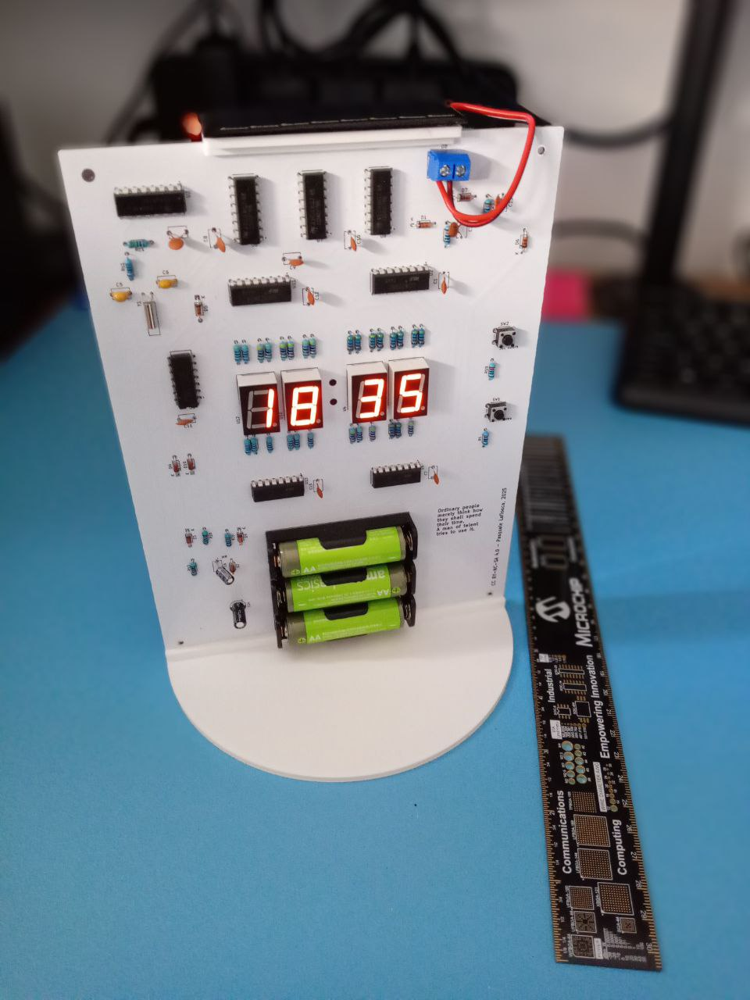
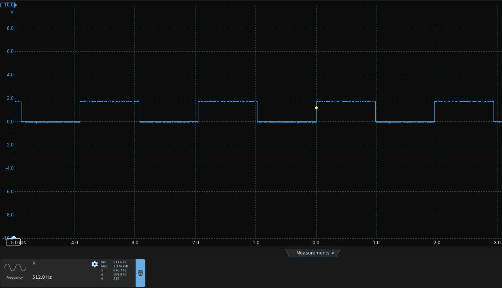

# Old Style Digital Clock
A simple, fully functional digital clock without microcontrollers.

## Features
- HH:MM 24-hour format.
- Based on common and readily available components like counters and logic gates.
- This clock uses a Pierce oscillator circuit (quartz crystal), so it will keep the time much more accurately than a NE555 or similar timers.
- Powered by 3 x AA 1.2 V rechargeable batteries.
- Solar cell power arrangement.

### Power considerations
The LEDs are relatively power consuming. Increasing the resistors between the CD4026BE and the 7-segment LEDs can help increase battery life. However, this was not sufficient. The batteries were not charging quickly enough to keep up with the power drained by the LEDs.

The CD4026BE has a DISPLAY ENABLE IN pin. The first DISPLAY ENABLE IN is connected to the 512 Hz oscillator signal (Q4, pin 7 of the CD4060BE). Its DISPLAY ENABLE OUT is cascaded to the following DISPLAY ENABLE IN on the follwing CD4026BE.

The advantage is twofold:
- the LED power consumption is reduced by 50% (the brightness attenuation seemed minimal),
- for half of the period, most of the solar power flows to the rechargeable batteries, achieving a sort of "trickle charge" effect. 

This is the signal measured at one active LED segment:

## PCB printing
A standard 2-layer PCB is used. You may use the [FabricationOutput.zip](FabricationOutput.zip) file directly to order the PCM from your supplier. It contains the necessary Gerbers and drill files.

## License
This project is licensed under the Creative Commons Attribution-NonCommercial-ShareAlike 4.0 International License (CC BY-NC-SA 4.0).

You are free to:
- Share — copy and redistribute the material in any medium or format.
- Adapt — remix, transform, and build upon the material.
Under the following terms:
- Attribution — You must give appropriate credit, provide a link to the license, and indicate if changes were made. You may do so in any reasonable manner, but not in any way that suggests the licensor endorses you or your use.
- NonCommercial — You may not use the material for commercial purposes.
- ShareAlike — If you remix, transform, or build upon the material, you must distribute your contributions under the same license as the original.
To view a copy of this license, visit https://creativecommons.org/licenses/by-nc-sa/4.0/.
