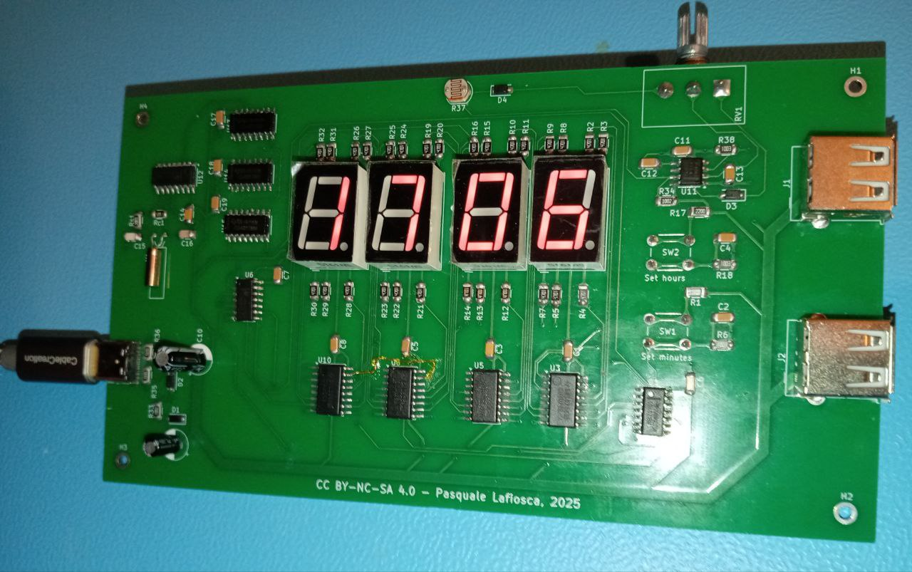
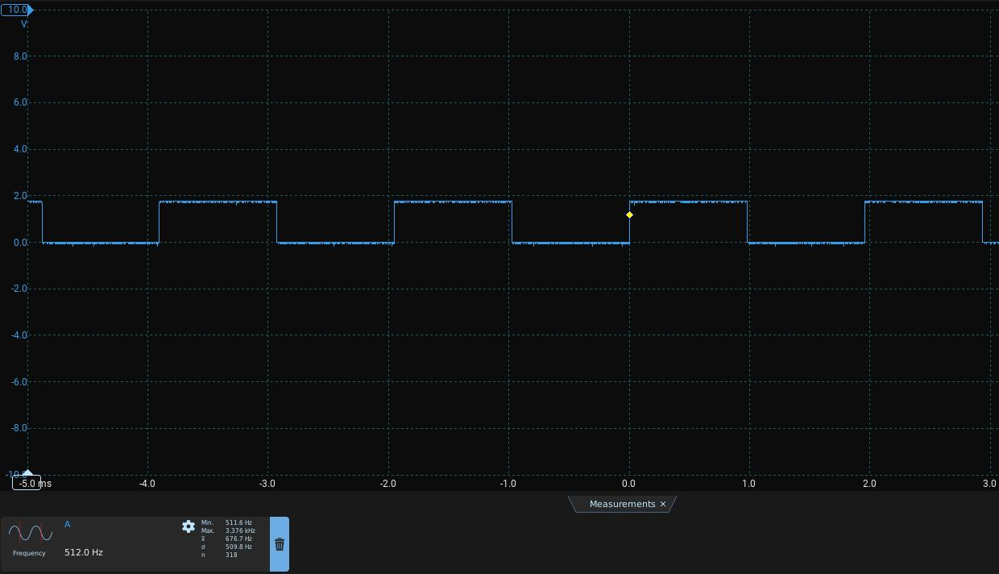

# Old Style Digital Clock
A simple, fully functional digital clock without microcontrollers.

## Features
- HH:MM 24-hour format.
- Based on common and readily available components like counters and logic gates.
- This clock uses a Pierce oscillator circuit (quartz crystal), so it will keep the time much more accurately than a NE555 or similar timers.
- Powered by USB C female port.
- 2 x USB A ports for charging other devices (as dedicated charging ports - DCPs).
- Dimmable LEDs and self-adjusting brightness.

### LED brightness control
LEDs may result too faint in daylight and too bright at night. Therefore brightness is controlled by pulse-width modulation (PWM) and a potentiometer to adjust the duty cycle.
Furthermore, a light-dependent resistor (LDR) is introduced to automatically reduce the duty cycle at night.

The signal measured at one active LED segment is a square wave of a frequency > 30 Hz so that human eye cannot notice the flickering:

You may notice flickering if you use a camera to look at the clock. If this is a concern, you may reduce the C13 capacitor value to increase the frequency to the desired level. Full details in the schematics.

## PCB printing
A standard 2-layer PCB is used. You may use the [FabricationOutput](FabricationOutput) folder, zip it and order directly from your supplier. It contains the necessary Gerbers and drill files.

## 3D models
The clock may be completed by printing the case. See [3D printed parts](3D%20printed%20parts) folder. 

## License
This project is licensed under the Creative Commons Attribution-NonCommercial-ShareAlike 4.0 International License (CC BY-NC-SA 4.0).

You are free to:
- Share — copy and redistribute the material in any medium or format.
- Adapt — remix, transform, and build upon the material.
Under the following terms:
- Attribution — You must give appropriate credit, provide a link to the license, and indicate if changes were made. You may do so in any reasonable manner, but not in any way that suggests the licensor endorses you or your use.
- NonCommercial — You may not use the material for commercial purposes.
- ShareAlike — If you remix, transform, or build upon the material, you must distribute your contributions under the same license as the original.
To view a copy of this license, visit https://creativecommons.org/licenses/by-nc-sa/4.0/.
