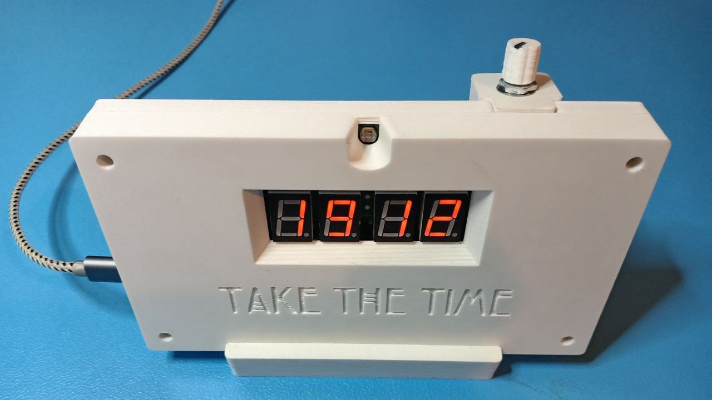

# Old Style Digital Clock
A simple, fully functional digital clock without microcontrollers.

## Features
- HH:MM 24-hour format.
- Based on common and readily available components like counters and logic gates.
- This clock uses a Pierce oscillator circuit (quartz crystal), so it will keep the time much more accurately than a NE555 or similar timers.
- Powered by USB C female port.
- 2 x USB A ports for charging other devices (as dedicated charging ports - DCPs).
- Dimmable LEDs and self-adjusting brightness.

### LED brightness control
LEDs may result too faint in daylight and too bright at night. Therefore brightness is controlled by pulse-width modulation (PWM) and a potentiometer to adjust the duty cycle.
Furthermore, a light-dependent resistor (LDR) is introduced to automatically reduce the duty cycle at night.

The signal measured at one active LED segment is a square wave of a frequency > 30 Hz so that human eye cannot notice the flickering:

You may notice flickering if you use a camera to look at the clock. If this is a concern, you may reduce the C13 capacitor value to increase the frequency to the desired level. Full details in the schematics.

## PCB printing
A standard 2-layer PCB is used. You may generate the necessary Gerber and drill files using KiCad according to the specs of your supplier.

## 3D models
The clock may be completed by printing the case. See [3D printed parts](3DPrintedParts) folder. 

## License
This project is licensed under the **CC BY-NC-SA 4.0** license.  
© 2025 Pasquale Lafiosca

For more details, see the [LICENSE](LICENSE) file.
